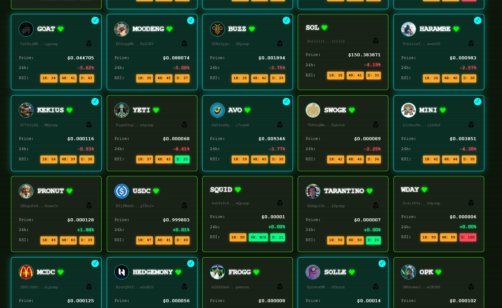
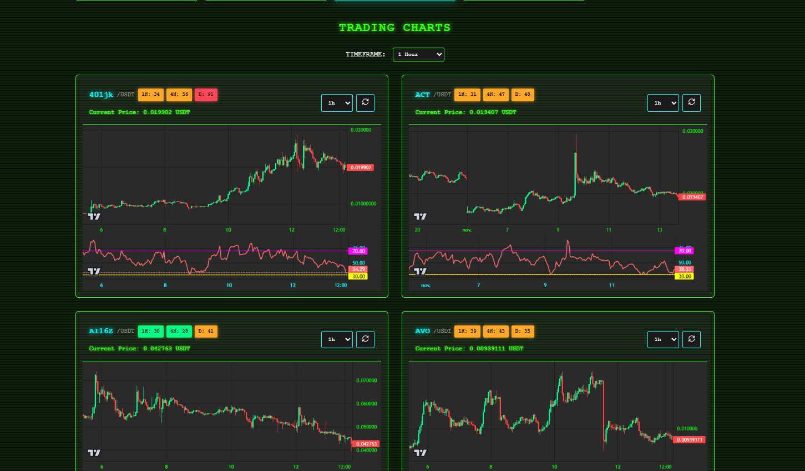
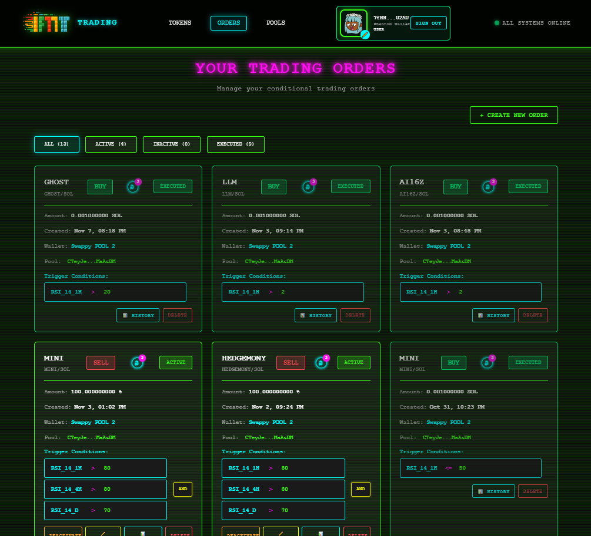
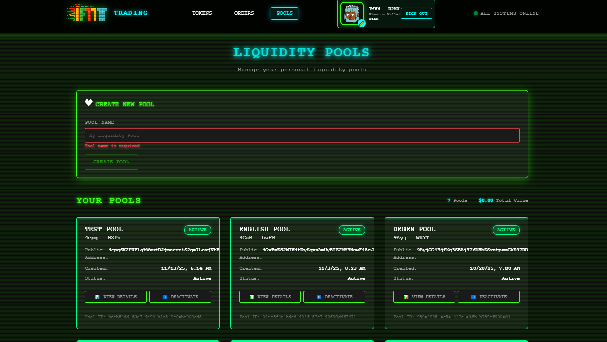
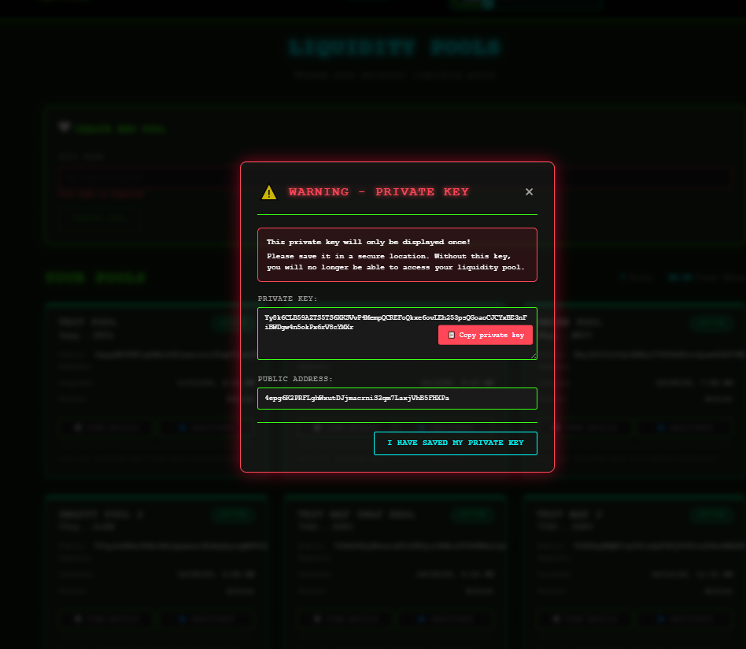

# IFTTT-Trading - Automated Trading Platform Specification

**Version**: 1.0
**Last Updated**: November 2025
**Status**: Production-Ready MVP

---

## Table of Contents

1. [Executive Summary](#executive-summary)
2. [System Overview](#system-overview)
3. [Core Concepts](#core-concepts)
4. [Technical Architecture](#technical-architecture)
5. [Technology Stack](#technology-stack)
6. [Data Model](#data-model)
7. [Security & Authentication](#security--authentication)
8. [User Workflows](#user-workflows)
9. [API Integration](#api-integration)
10. [Deployment Architecture](#deployment-architecture)

---

## 1. Executive Summary

**IFTTT-Trading** is an automated trading platform for Solana blockchain tokens that enables users to create sophisticated conditional orders based on technical indicators and market conditions. The platform combines the flexibility of IFTTT-style conditional logic with the security of non-custodial wallet management.

### Key Features

- **Non-Custodial Architecture**: Users maintain full control of their funds through liquidity pools
- **Conditional Trading**: Execute trades based on RSI, price, volume, and market cap conditions
- **Multi-Strategy Automation**: Complex conditional logic with AND/OR operators
- **Real-Time Market Data**: Live price feeds and technical indicators
- **Secure Key Management**: Private keys encrypted in HashiCorp Vault
- **Retrogaming UI**: Unique interface inspired by classic arcade aesthetics

### Business Value

- **No Locked Liquidity**: Funds remain accessible, not frozen in order books
- **24/7 Automation**: Execute trades automatically when conditions are met
- **Risk Management**: Automated stop-loss and take-profit strategies
- **Technical Analysis**: Built-in RSI, EMA, and price indicators
- **Multi-Wallet Support**: Manage multiple trading pools simultaneously

---

## 2. System Overview

### 2.1 High-Level Architecture

```
┌─────────────────────────────────────────────────────────────────┐
│                         User Interface                           │
│                  (Angular 18 - Retrogaming UI)                   │
└──────────────┬──────────────────────────────────┬───────────────┘
               │                                    │
               ▼                                    ▼
┌──────────────────────────┐         ┌───────────────────────────┐
│   IFTTT Backend API      │◄────────┤   N8N Workflow Engine     │
│   (NestJS + PostgreSQL)  │         │   (Business Logic Core)   │
└────┬─────────────┬───────┘         └───────────────────────────┘
     │             │
     ▼             ▼
┌─────────┐   ┌──────────────┐       ┌───────────────────────────┐
│ OHLCV   │   │ Solana Swap  │◄──────┤   HashiCorp Vault         │
│ API     │   │ API          │       │   (Private Keys Storage)  │
└─────────┘   └──────────────┘       └───────────────────────────┘
     │             │
     ▼             ▼
┌─────────────────────────────────────────────────────────────────┐
│                    Solana Blockchain (Mainnet)                   │
│              Jupiter Aggregator • DEX Protocols                  │
└─────────────────────────────────────────────────────────────────┘
```

### 2.2 Component Responsibilities

| Component | Role | Technology |
|-----------|------|------------|
| **Frontend** | User interface, real-time updates | Angular 18, WebSocket, TradingView |
| **IFTTT Backend** | API Gateway, business logic, authentication | NestJS 10, TypeORM, PostgreSQL 15 |
| **N8N Engine** | Trading workflow orchestrator, condition evaluation | N8N, OAuth2 service account |
| **OHLCV API** | Market data provider, technical indicators | Node.js, InfluxDB, SQLite |
| **Swap API** | Transaction signing and execution | Node.js, Solana Web3.js, Jupiter SDK |
| **Vault** | Encrypted secrets storage | HashiCorp Vault 1.18, KV v2 engine |

---

## 3. Core Concepts

### 3.1 Liquidity Pools (Non-Custodial Wallets)

**What they are**: Standard Solana wallets with user-defined names, functioning as isolated trading accounts.

**Key Characteristics**:
- Each pool is a real Solana wallet with a unique public/private key pair
- Private keys stored encrypted in HashiCorp Vault
- User receives private key **once** during creation (must save securely)
- Funds can be withdrawn anytime to external wallets (Phantom, Solflare, etc.)
- No liquidity locking - tokens remain transferable

**Non-Custodial Guarantee**:
```
┌─────────────────────────────────────────────────────────────┐
│  USER creates pool                                           │
│    ↓                                                          │
│  SYSTEM generates Solana keypair                             │
│    ↓                                                          │
│  Private key → Vault (encrypted at rest)                     │
│  Public key → PostgreSQL (wallets table)                     │
│    ↓                                                          │
│  USER receives private key in popup (DISPLAYED ONCE)         │
│    ↓                                                          │
│  USER saves private key securely (user responsibility)       │
│    ↓                                                          │
│  USER can export funds anytime to external wallet            │
└─────────────────────────────────────────────────────────────┘
```

**Advantages over Traditional Order Books**:
- ✅ No minimum deposit requirements
- ✅ Instant liquidity access (no withdrawal delays)
- ✅ Lower gas fees (no order placement fees)
- ✅ Full custody of funds
- ✅ Can use funds outside platform simultaneously

### 3.2 Conditional Orders (IFTTT-Style)

**Philosophy**: Execute trades automatically when market conditions match user-defined criteria.

**Supported Conditions**:

| Condition Type | Description | Example |
|---------------|-------------|---------|
| **RSI_14** | Relative Strength Index (14 periods) | RSI_14(1h) > 70 (overbought) |
| **RSI_7** | Relative Strength Index (7 periods) | RSI_7(4h) < 30 (oversold) |
| **PRICE** | Token price in USD | PRICE < $0.001 |
| **BTC_PRICE** | Bitcoin price (market sentiment) | BTC_PRICE > $100,000 |
| **VOLUME_24H** | 24-hour trading volume | VOLUME_24H > $1M |
| **MARKET_CAP** | Token market capitalization | MARKET_CAP > $10M |

**Logical Operators**:
- **AND**: All conditions must be true
- **OR**: At least one condition must be true

**Example Scenario**:
```
Order Name: "Buy MOODENG on RSI dip"
Type: BUY
Target Token: MOODENG
Source Token: USDC
Amount: 50% of pool balance

Conditions:
  IF RSI_14(1h) <= 30 (oversold)
  AND PRICE < $0.001 (below target)
  THEN swap 50% USDC to MOODENG

Result: Automatic execution when both conditions met
```

### 3.3 Automated Execution Flow

```
┌─────────────────────────────────────────────────────────────┐
│  1. USER creates order with conditions                       │
│     Status: PENDING → ACTIVE                                 │
└──────────────────────┬──────────────────────────────────────┘
                       ▼
┌─────────────────────────────────────────────────────────────┐
│  2. N8N polls orders every 1-5 minutes                       │
│     GET /api/orders?status=ACTIVE                            │
└──────────────────────┬──────────────────────────────────────┘
                       ▼
┌─────────────────────────────────────────────────────────────┐
│  3. N8N evaluates conditions via OHLCV API                   │
│     GET /api/ohlcv/candles/{token}?timeframe=1h             │
│     GET /api/ohlcv/rsi/{token}?timeframe=1h&period=14       │
└──────────────────────┬──────────────────────────────────────┘
                       ▼
                 ┌──────────┐
                 │Conditions│
                 │   Met?   │
                 └─┬────┬───┘
              NO  │    │ YES
                  ▼    ▼
               [Skip] [Execute]
                       │
                       ▼
┌─────────────────────────────────────────────────────────────┐
│  4. N8N triggers swap via Gateway                            │
│     POST /api/swap/execute                                   │
│     {walletId, fromToken, toToken, amount}                   │
└──────────────────────┬──────────────────────────────────────┘
                       ▼
┌─────────────────────────────────────────────────────────────┐
│  5. Gateway → Swap API (internal)                            │
│     Swap API retrieves private key from Vault                │
│     Signs transaction with private key                       │
│     Submits to Solana RPC (Jupiter routing)                  │
└──────────────────────┬──────────────────────────────────────┘
                       ▼
┌─────────────────────────────────────────────────────────────┐
│  6. Transaction confirmed on Solana blockchain               │
│     Order status: ACTIVE → EXECUTED                          │
│     Transaction record created in PostgreSQL                 │
│     WebSocket notification to frontend                       │
└─────────────────────────────────────────────────────────────┘
```

---

## 4. Technical Architecture

### 4.1 Microservices Architecture

The platform follows an **API Gateway pattern** with internal microservices:

```
                      ┌─────────────────────┐
                      │   Angular Frontend  │
                      │   (Port 4200 dev)   │
                      └──────────┬──────────┘
                                 │ HTTP/WS
                                 ▼
                      ┌─────────────────────┐
                      │  IFTTT Backend API  │◄───────────┐
                      │    (NestJS 10)      │            │
                      │    Port 3000        │            │ OAuth2
                      └──┬──────────┬───────┘            │
                         │          │                    │
         ┌───────────────┘          └────────┐      ┌────────┐
         │ Internal                Internal  │      │  N8N   │
         ▼                                   ▼      │  Port  │
┌─────────────────┐              ┌─────────────────┤  5678  │
│   OHLCV API     │              │  Solana Swap    │        │
│   (Express)     │              │      API        │        │
│   Port 3002     │              │   (Express)     │        │
│   INTERNAL      │              │   Port 3001     │        │
└─────┬───────────┘              └────────┬────────┘        │
      │                                   │                 │
      │ InfluxDB                          │ Vault           │
      │ SQLite                            │ KV v2           │
      ▼                                   ▼                 │
┌─────────────────┐              ┌──────────────────┐      │
│   Market Data   │              │  Private Keys    │      │
│   • Candles     │              │  Encrypted       │      │
│   • RSI, EMA    │              │  Storage         │      │
└─────────────────┘              └──────────────────┘      │
                                                            │
         ┌──────────────────────────────────────────────────┘
         │ PostgreSQL (Shared Database)
         ▼
┌──────────────────────────────────────────┐
│  • users, wallets, orders                │
│  • order_conditions, transactions        │
│  • service_account (N8N auth)            │
└──────────────────────────────────────────┘
```

### 4.2 Service Responsibilities

#### **iftt-trading-automation** (Main Application)
- **API Gateway**: Single entry point, proxies requests to internal services
- **Business Logic**: Order management, user CRUD, wallet CRUD
- **Authentication**: JWT, Google OAuth2, Phantom Wallet signature verification
- **Real-Time**: WebSockets for live updates (order execution, price changes)
- **Gateway Modules**:
  - `OhlcvModule`: Proxies to OHLCV API (candles, RSI, prices)
  - `SolanaSwapModule`: Proxies to Swap API (quote, execute)
  - `DexScreenerModule`: Real-time market data
  - `JupiterModule`: Jupiter aggregator quotes

#### **custom-solcrates-ohlcv-api** (Market Data Provider)
- **Price Collection**: Polls Jupiter API every 5 seconds for real-time prices
- **Candlestick Construction**: 1m, 5m, 15m, 1h, 4h, 1d timeframes
- **Technical Indicators**: RSI (Wilder method), EMA
- **Historical Backfill**: 30 days via GeckoTerminal API
- **Storage**: InfluxDB (time-series), SQLite (token metadata)
- **Access**: Internal only (not exposed to public)

#### **solana-swap-api** (Transaction Executor)
- **Wallet Management**: Create, retrieve wallets from Vault
- **Transaction Signing**: Signs Solana transactions with private keys
- **Jupiter Integration**: Optimal swap routing via Jupiter SDK v6
- **Balance Queries**: SOL and SPL token balances
- **Security**: Rate limiting (10 req/15min), JWT auth, AppRole for Vault
- **Access**: Internal only (accessed via Gateway)

#### **hashicorp-vault** (Secrets Manager)
- **KV v2 Engine**: Stores private keys at `secret/data/wallets/{address}`
- **AppRole Authentication**: Service-to-service auth (Swap API ↔ Vault)
- **Encryption**: AES-256-GCM encryption at rest
- **Audit Logging**: All access logged for security compliance
- **SSL/TLS**: Native HTTPS with Let's Encrypt certificates
- **UI**: Web interface for manual key management

#### **n8n** (Workflow Orchestrator)
- **Central Logic**: Core of trading automation
- **Polling**: Checks active orders every 1-5 minutes
- **Condition Evaluation**: Reads OHLCV data, evaluates conditions
- **Execution**: Triggers swaps when conditions met
- **Authentication**: OAuth2 service account (scoped permissions)
- **Isolation**: Runs on separate Docker network

### 4.3 Network Topology

```
┌─────────────────────────────────────────────────────────────┐
│  Docker Network: iftt-network                                │
│  ┌──────────────┐  ┌───────────┐  ┌──────────────────────┐ │
│  │ iftt-backend │  │ ohlcv-api │  │ iftt-frontend        │ │
│  │              │  │           │  │                      │ │
│  └──────┬───────┘  └─────┬─────┘  └──────────────────────┘ │
│         │                │                                   │
│         └────────┬───────┘                                   │
│                  │                                           │
└──────────────────┼───────────────────────────────────────────┘
                   │
                   ▼
┌─────────────────────────────────────────────────────────────┐
│  Docker Network: ifft_trading (external)                     │
│  ┌───────────────┐  ┌─────────────┐  ┌──────────────────┐  │
│  │ PostgreSQL 15 │  │ solana-swap │  │ HashiCorp Vault  │  │
│  │               │  │    API      │  │                  │  │
│  └───────────────┘  └─────────────┘  └──────────────────┘  │
└─────────────────────────────────────────────────────────────┘
                                  ▲
                                  │ OAuth2
                                  │
┌─────────────────────────────────┴───────────────────────────┐
│  Docker Network: default (n8n isolation)                     │
│  ┌────────────────────────────────────────────────────────┐ │
│  │  N8N (accesses services via host IP)                  │ │
│  └────────────────────────────────────────────────────────┘ │
└─────────────────────────────────────────────────────────────┘
```

---

## 5. Technology Stack

### 5.1 Frontend Stack

```yaml
Framework: Angular 18.2 (Standalone Components)
Language: TypeScript 5.5
Styling: SCSS (custom retrogaming design)
State Management: RxJS 7.8
Real-Time: Socket.io-client 4.8.1
Charts:
  - TradingView Widgets
  - Lightweight Charts 5.0.9
UI Components:
  - Lucide Angular (icons)
  - DiceBear (pixel art avatars)
  - Custom pixel art icons
Build: Angular CLI with Node.js 20
```

### 5.2 Backend Stack

```yaml
Framework: NestJS 10.3
Language: TypeScript 5.3
Database ORM: TypeORM 0.3.17
Database: PostgreSQL 15
Authentication:
  - Passport JWT
  - Passport Google OAuth2
  - Solana signature verification (tweetnacl, bs58)
WebSockets: Socket.io 4.7.4
Blockchain: @solana/web3.js 1.87.6
Caching: Redis/ioredis 5.3.2
Documentation: Swagger (OpenAPI 3.0)
```

### 5.3 Infrastructure Stack

```yaml
Containerization: Docker 24, Docker Compose
Secrets Management: HashiCorp Vault 1.18.0
Workflow Automation: N8N
Reverse Proxy: Nginx (SWAG) with Let's Encrypt SSL
Databases:
  - PostgreSQL 15 (relational data)
  - InfluxDB 2.7 (time-series OHLCV)
  - SQLite (token metadata)
  - Redis (caching)
```

### 5.4 Blockchain Stack

```yaml
Blockchain: Solana (mainnet-beta)
RPC Provider: Public Solana RPC endpoints
DEX Aggregator: Jupiter SDK v6 (@jup-ag/api 6.0.44)
Market Data:
  - Jupiter API (real-time prices)
  - GeckoTerminal API (historical data)
  - DexScreener API (market data)
Wallet: Standard Solana Keypair (Ed25519)
```

---

## 6. Data Model

### 6.1 Entity Relationship Diagram

```
┌─────────────┐         ┌──────────────┐         ┌─────────────┐
│   users     │1       *│   wallets    │1       *│   orders    │
│─────────────│◄────────│──────────────│◄────────│─────────────│
│ id (PK)     │         │ id (PK)      │         │ id (PK)     │
│ phantom_pk  │         │ user_id (FK) │         │ user_id(FK) │
│ google_email│         │ name         │         │ wallet_id FK│
│ role (ADMIN)│         │ public_key   │         │ name        │
│ is_active   │         │ private_path │         │ type(BUY/SL)│
│ created_at  │         │ vault_name   │         │ target_token│
└─────────────┘         │ is_active    │         │ amount_type │
                        │ created_at   │         │ status      │
                        └──────────────┘         │ execution   │
                                                 │ executed_at │
                                                 └──────┬──────┘
                                                        │1
                                                        │
                                                       *│
                                          ┌─────────────┴──────┐
                                          │ order_conditions   │
                                          │────────────────────│
                                          │ id (PK)            │
                                          │ order_id (FK)      │
                                          │ condition_type     │
                                          │ timeframe          │
                                          │ operator (>,<,=)   │
                                          │ threshold_value    │
                                          │ logic_operator     │
                                          │ order_position     │
                                          └────────────────────┘

┌─────────────┐         ┌──────────────────────┐
│transactions │         │ solana_tokens_ref    │
│─────────────│         │──────────────────────│
│ id (PK)     │         │ id (PK)              │
│ user_id(FK) │         │ symbol (USDC,SOL)    │
│ wallet_id   │         │ contract_address     │
│ order_id(FK)│         │ token_type (NATIVE)  │
│ type        │         │ decimals             │
│ from_token  │         │ is_stablecoin        │
│ to_token    │         │ is_base_currency     │
│ from_amount │         └──────────────────────┘
│ to_amount   │
│ fee_amount  │         ┌──────────────────────┐
│ solana_sig  │         │ service_account      │
│ status      │         │──────────────────────│
│ error_msg   │         │ id (PK)              │
│ confirmed_at│         │ name (n8n-auto)      │
└─────────────┘         │ type (AUTOMATION)    │
                        │ api_key (hashed)     │
                        │ scopes (JSON)        │
                        │ allowed_ips          │
                        │ expires_at           │
                        └──────────────────────┘
```

### 6.2 Key Tables

#### **users** (Authentication & Authorization)
```sql
CREATE TABLE users (
  id UUID PRIMARY KEY DEFAULT gen_random_uuid(),
  phantom_public_key VARCHAR(44) UNIQUE,  -- Solana wallet
  google_email VARCHAR(255) UNIQUE,
  google_id VARCHAR(255) UNIQUE,
  role VARCHAR(20) DEFAULT 'USER',  -- ADMIN | USER
  is_active BOOLEAN DEFAULT true,
  last_login TIMESTAMP,
  created_at TIMESTAMP DEFAULT NOW(),
  updated_at TIMESTAMP DEFAULT NOW()
);
```

#### **wallets** (Liquidity Pools)
```sql
CREATE TABLE wallets (
  id UUID PRIMARY KEY DEFAULT gen_random_uuid(),
  user_id UUID REFERENCES users(id) ON DELETE CASCADE,
  name VARCHAR(100) NOT NULL,
  public_key VARCHAR(44) UNIQUE NOT NULL,  -- Solana address
  private_key_vault_path VARCHAR(255) NOT NULL,  -- Vault path
  vault_wallet_name VARCHAR(100),
  is_active BOOLEAN DEFAULT true,
  created_at TIMESTAMP DEFAULT NOW(),
  updated_at TIMESTAMP DEFAULT NOW()
);
```

#### **orders** (Trading Orders)
```sql
CREATE TABLE orders (
  id UUID PRIMARY KEY DEFAULT gen_random_uuid(),
  user_id UUID REFERENCES users(id),
  wallet_id UUID REFERENCES wallets(id),
  name VARCHAR(200) NOT NULL,
  type VARCHAR(20) NOT NULL,  -- BUY | SELL
  target_token_address VARCHAR(44) NOT NULL,
  from_token_address VARCHAR(44) NOT NULL,
  amount_type VARCHAR(20) NOT NULL,  -- FIXED | PERCENTAGE
  amount_value DECIMAL(20, 8) NOT NULL,
  status VARCHAR(20) DEFAULT 'PENDING',  -- PENDING|ACTIVE|EXECUTED|CANCELLED|FAILED
  execution_log TEXT,
  executed_at TIMESTAMP,
  created_at TIMESTAMP DEFAULT NOW(),
  updated_at TIMESTAMP DEFAULT NOW()
);
```

#### **order_conditions** (IFTTT Conditions)
```sql
CREATE TABLE order_conditions (
  id UUID PRIMARY KEY DEFAULT gen_random_uuid(),
  order_id UUID REFERENCES orders(id) ON DELETE CASCADE,
  condition_type VARCHAR(50) NOT NULL,  -- RSI_14|RSI_7|PRICE|BTC_PRICE|VOLUME_24H|MARKET_CAP
  base_token_address VARCHAR(44),
  quote_token_address VARCHAR(44),
  timeframe VARCHAR(10),  -- 1m|5m|15m|1h|4h|1d
  operator VARCHAR(10) NOT NULL,  -- >|<|=|>=|<=
  threshold_value DECIMAL(30, 10) NOT NULL,
  logic_operator VARCHAR(10),  -- AND | OR
  order_position INTEGER NOT NULL,
  created_at TIMESTAMP DEFAULT NOW()
);
```

---

## 7. Security & Authentication

### 7.1 Multi-Strategy Authentication

The platform supports three authentication methods:

#### **1. Phantom Wallet (Primary for Crypto Users)**
```typescript
// Authentication Flow
1. User clicks "Connect Phantom Wallet"
2. Phantom extension prompts signature request
3. User signs message with private key (off-chain)
4. Backend verifies signature using nacl.sign.detached.verify()
5. JWT session token issued (expires: 7 days)
6. Public key stored as unique user identifier
```

**Advantages**:
- No password management
- Cryptographic proof of ownership
- Familiar to crypto users

#### **2. Google OAuth2 (Web Users)**
```typescript
// Authentication Flow
1. User clicks "Sign in with Google"
2. Redirected to Google OAuth consent screen
3. Google returns authorization code
4. Backend exchanges code for access token
5. Backend fetches user profile (email, name)
6. JWT session token issued
7. Role assignment based on configuration

Admin privileges: Manage all users/wallets/orders
```

#### **3. Service Account (N8N Automation)**
```typescript
// Authentication Flow
1. N8N configured with API key (environment variable)
2. N8N sends: POST /api/auth/service-account
   Headers: { "X-API-Key": "ENCRYPTED_API_KEY" }
3. Backend validates API key (bcrypt.compare)
4. Backend checks:
   - Expiration date (expires_at)
   - IP whitelist (allowed_ips)
   - Active status (is_active)
5. JWT issued with scopes:
   - orders:read, orders:write
   - swap:execute
   - ohlcv:read
6. JWT expires after 1 hour (auto-refresh)
```

### 7.2 Security Layers

```
┌───────────────────────────────────────────────────────────┐
│  Layer 1: Network Security                                 │
│  • Docker networks isolation (iftt-network, vault-network) │
│  • Firewall rules (UFW)                                    │
│  • Rate limiting (10 req/15min on Swap API)                │
└───────────────────────────────────────────────────────────┘
                         ▼
┌───────────────────────────────────────────────────────────┐
│  Layer 2: Application Security                             │
│  • JWT authentication (all endpoints)                      │
│  • Role-based access control (ADMIN/USER)                  │
│  • Input validation (class-validator)                      │
│  • SQL injection prevention (TypeORM parameterized)        │
│  • XSS protection (CSP headers)                            │
│  • CSRF protection (SameSite cookies)                      │
└───────────────────────────────────────────────────────────┘
                         ▼
┌───────────────────────────────────────────────────────────┐
│  Layer 3: Secrets Management                               │
│  • HashiCorp Vault (AES-256-GCM encryption at rest)        │
│  • AppRole authentication (service-to-service)             │
│  • mTLS (mutual TLS for Vault communication)               │
│  • Audit logging (all key access logged)                   │
└───────────────────────────────────────────────────────────┘
                         ▼
┌───────────────────────────────────────────────────────────┐
│  Layer 4: Blockchain Security                              │
│  • Private key never leaves Vault (except initial display) │
│  • Transaction signing in memory (ephemeral)               │
│  • Signature verification before submission                │
│  • Slippage protection (max 1% default)                    │
└───────────────────────────────────────────────────────────┘
```

### 7.3 Private Key Lifecycle

```
┌─────────────────────────────────────────────────────────┐
│  CREATION PHASE                                          │
│  1. User creates pool "My Trading Pool"                  │
│  2. Solana Keypair generated (Ed25519)                   │
│  3. Private key → Vault: secret/data/wallets/{address}   │
│  4. Public key → PostgreSQL: wallets.public_key          │
│  5. Private key DISPLAYED ONCE in modal popup            │
│  6. User MUST copy and save (app does not store)         │
└─────────────────────────────────────────────────────────┘
                       ▼
┌─────────────────────────────────────────────────────────┐
│  USAGE PHASE                                             │
│  1. N8N triggers swap execution                          │
│  2. Swap API authenticates with Vault (AppRole)          │
│  3. Swap API reads: GET /v1/secret/data/wallets/{addr}   │
│  4. Private key loaded into memory (Buffer)              │
│  5. Transaction signed: nacl.sign.detached(tx, privKey)  │
│  6. Private key wiped from memory                        │
│  7. Signed transaction → Solana RPC                      │
└─────────────────────────────────────────────────────────┘
                       ▼
┌─────────────────────────────────────────────────────────┐
│  EXPORT PHASE (User-Initiated)                           │
│  1. User can export funds to external wallet anytime     │
│  2. No platform permission required                      │
│  3. User owns private key → full control                 │
└─────────────────────────────────────────────────────────┘
```

---

## 8. User Workflows

### 8.1 Pool Creation Workflow

```
┌──────────────────────────────────────────────────────────┐
│  USER INTERFACE                                           │
│  • User clicks "Create New Pool"                          │
│  • Enters pool name (e.g., "Aggressive Trading")          │
│  • Clicks "Create Pool"                                   │
└───────────────────────┬──────────────────────────────────┘
                        ▼
┌──────────────────────────────────────────────────────────┐
│  BACKEND API (POST /api/wallets)                          │
│  • Validates pool name (unique per user)                  │
│  • Calls Swap API: POST /wallets/create                   │
└───────────────────────┬──────────────────────────────────┘
                        ▼
┌──────────────────────────────────────────────────────────┐
│  SWAP API                                                 │
│  • Generates Solana Keypair: Keypair.generate()           │
│  • Saves to Vault: PUT /v1/secret/data/wallets/{address}  │
│    {                                                      │
│      "private_key": "base58_encoded_key",                 │
│      "created_by": "user_id",                             │
│      "created_at": "2025-11-13T10:00:00Z"                 │
│    }                                                      │
│  • Returns: { publicKey, privateKey }                     │
└───────────────────────┬──────────────────────────────────┘
                        ▼
┌──────────────────────────────────────────────────────────┐
│  BACKEND API                                              │
│  • Inserts into PostgreSQL:                               │
│    INSERT INTO wallets (user_id, name, public_key,        │
│                         private_key_vault_path)           │
│  • Returns wallet object + private_key to frontend        │
└───────────────────────┬──────────────────────────────────┘
                        ▼
┌──────────────────────────────────────────────────────────┐
│  FRONTEND MODAL                                           │
│  • Displays private key in modal:                         │
│    ⚠ WARNING: This private key will ONLY be shown once!  │
│    Private Key: [5a7b9c...]  [Copy Button]               │
│    Public Key: [Fg4x8...]                                │
│  • User MUST copy and save in secure location             │
│  • Checkbox: "I have saved my private key securely"       │
│  • Button: "I understand" (closes modal)                  │
└──────────────────────────────────────────────────────────┘
```

### 8.2 Order Creation Workflow

```
┌──────────────────────────────────────────────────────────┐
│  STEP 1: Order Configuration                              │
│  • Select pool: "Aggressive Trading"                      │
│  • Order name: "Buy BONK on RSI dip"                      │
│  • Type: BUY                                              │
│  • Target token: BONK                                     │
│  • Source token: USDC                                     │
│  • Amount: 25% of pool balance                            │
└───────────────────────┬──────────────────────────────────┘
                        ▼
┌──────────────────────────────────────────────────────────┐
│  STEP 2: Condition Builder                                │
│  Condition 1:                                             │
│    Type: RSI_14                                           │
│    Timeframe: 1h                                          │
│    Operator: <=                                           │
│    Value: 30                                              │
│    Logic: AND                                             │
│                                                           │
│  Condition 2:                                             │
│    Type: PRICE                                            │
│    Operator: <                                            │
│    Value: $0.000015                                       │
│    Logic: (end)                                           │
└───────────────────────┬──────────────────────────────────┘
                        ▼
┌──────────────────────────────────────────────────────────┐
│  STEP 3: Review & Confirm                                 │
│  Summary:                                                 │
│    IF RSI_14(1h) <= 30 AND PRICE < $0.000015             │
│    THEN buy BONK with 25% USDC                            │
│                                                           │
│  Estimated amount: 1,666,666 BONK                         │
│  Estimated fee: ~0.00025 SOL                              │
│                                                           │
│  [Cancel]  [Create Order]                                 │
└───────────────────────┬──────────────────────────────────┘
                        ▼
┌──────────────────────────────────────────────────────────┐
│  BACKEND API (POST /api/orders)                           │
│  • Validates order (wallet exists, tokens valid)          │
│  • Inserts into PostgreSQL:                               │
│    - orders table (status: PENDING)                       │
│    - order_conditions table (2 rows)                      │
│  • Updates status: PENDING → ACTIVE                       │
│  • Returns order object                                   │
└───────────────────────┬──────────────────────────────────┘
                        ▼
┌──────────────────────────────────────────────────────────┐
│  FRONTEND                                                 │
│  • Shows notification: "Order created successfully!"      │
│  • Redirects to Orders page                               │
│  • Order appears in "Active Orders" list                  │
│  • WebSocket listens for execution updates                │
└──────────────────────────────────────────────────────────┘
```

### 8.3 Automated Execution Workflow

```
┌──────────────────────────────────────────────────────────┐
│  N8N WORKFLOW (Every 1-5 minutes)                         │
│  1. GET /api/orders?status=ACTIVE                         │
│     Response: [ {order1}, {order2}, ... ]                 │
└───────────────────────┬──────────────────────────────────┘
                        ▼
┌──────────────────────────────────────────────────────────┐
│  FOR EACH ACTIVE ORDER:                                   │
│  2. Get order conditions from order.conditions[]          │
│  3. FOR EACH CONDITION:                                   │
│      IF type = "RSI_14":                                  │
│        GET /api/ohlcv/rsi/{token}?timeframe=1h&period=14  │
│        current_rsi = response.rsi                         │
│        condition_met = (current_rsi <= threshold)         │
│                                                           │
│      IF type = "PRICE":                                   │
│        GET /api/ohlcv/price/{token}                       │
│        current_price = response.price                     │
│        condition_met = (current_price < threshold)        │
└───────────────────────┬──────────────────────────────────┘
                        ▼
┌──────────────────────────────────────────────────────────┐
│  4. EVALUATE LOGIC                                        │
│     IF logic_operator = "AND":                            │
│       all_conditions_met = condition1 AND condition2      │
│     IF logic_operator = "OR":                             │
│       all_conditions_met = condition1 OR condition2       │
└───────────────────────┬──────────────────────────────────┘
                        ▼
                   ┌──────────┐
                   │  All     │
                   │Conditions│
                   │  Met?    │
                   └─┬────┬───┘
                NO  │    │ YES
                    ▼    ▼
                 [Skip] [Execute Swap]
                         │
                         ▼
┌──────────────────────────────────────────────────────────┐
│  5. SWAP EXECUTION                                        │
│  POST /api/swap/execute                                   │
│  {                                                        │
│    "walletId": "uuid",                                    │
│    "fromToken": "USDC_ADDRESS",                           │
│    "toToken": "BONK_ADDRESS",                             │
│    "amountType": "PERCENTAGE",                            │
│    "amountValue": 25,                                     │
│    "orderId": "order_uuid"                                │
│  }                                                        │
└───────────────────────┬──────────────────────────────────┘
                        ▼
┌──────────────────────────────────────────────────────────┐
│  6. SWAP API PROCESSING                                   │
│  • Retrieve wallet public_key from PostgreSQL             │
│  • Retrieve private_key from Vault                        │
│  • Get quote from Jupiter: POST /quote                    │
│  • Build swap transaction: POST /swap                     │
│  • Sign transaction with private_key                      │
│  • Submit to Solana RPC: sendTransaction()                │
│  • Wipe private_key from memory                           │
│  • Return transaction signature                           │
└───────────────────────┬──────────────────────────────────┘
                        ▼
┌──────────────────────────────────────────────────────────┐
│  7. POST-EXECUTION                                        │
│  • Update order status: ACTIVE → EXECUTED                 │
│  • Insert transaction record (signature, amounts, fees)   │
│  • Send WebSocket event: "order_executed"                 │
│  • N8N logs execution in workflow history                 │
└───────────────────────┬──────────────────────────────────┘
                        ▼
┌──────────────────────────────────────────────────────────┐
│  8. FRONTEND NOTIFICATION                                 │
│  • WebSocket receives "order_executed" event              │
│  • Toast notification: "Order executed! +1.6M BONK"       │
│  • Orders page auto-refreshes                             │
│  • Order moved to "Executed Orders" tab                   │
│  • Transaction appears in history                         │
└──────────────────────────────────────────────────────────┘
```

---

## 9. API Integration

### 9.1 External APIs

#### **Jupiter Aggregator v6**
- **Purpose**: Optimal swap routing across Solana DEXs
- **Endpoints**:
  - `GET /quote`: Get best price for token swap
  - `POST /swap`: Build swap transaction
- **Features**: Multi-hop routing, price impact, slippage protection
- **SDK**: @jup-ag/api 6.0.44

#### **GeckoTerminal API**
- **Purpose**: Historical OHLCV data (30 days backfill)
- **Rate Limit**: 30 requests/minute
- **Endpoints**:
  - `GET /networks/solana/pools/{address}/ohlcv/{timeframe}`
- **Used For**: Initial data loading, missing candle backfill

#### **DexScreener API**
- **Purpose**: Real-time market data for TradingView
- **Endpoints**:
  - `GET /latest/dex/tokens/{address}`
- **Data**: Price, volume, market cap, 24h changes

### 9.2 Internal API Gateway

All internal microservices accessed via Gateway modules:

```typescript
// Example: Getting RSI via Gateway
Frontend → POST http://backend:3000/api/ohlcv/rsi
Gateway → GET http://ohlcv-api:3002/rsi/{token}?timeframe=1h&period=14
Response → { rsi: 28.5, timestamp: "2025-11-13T10:00:00Z" }

// Example: Executing swap via Gateway
N8N → POST http://backend:3000/api/swap/execute
Gateway → POST http://solana-swap-api:3001/swap/execute
Swap API → Retrieves key from Vault
Swap API → Signs transaction
Swap API → Submits to Solana
Response → { signature: "5x7y9z...", status: "confirmed" }
```

---

## 10. Deployment Architecture

### 10.1 Current Setup (Development/Staging)

```yaml
Environment: Docker Compose on Linux VM
Services:
  - iftt-frontend: Port 4200 (hot reload)
  - iftt-backend: Port 3000 (nest start --watch)
  - ohlcv-api: Port 3002 (nodemon)
  - solana-swap-api: Port 3001
  - hashicorp-vault: Port 8200 (HTTPS)
  - n8n: Port 5678
  - postgresql: Port 5432
  - influxdb: Port 8086
  - redis: Port 6379
```

### 10.2 Production Architecture (Planned)

```
                      ┌────────────────────┐
                      │   Traefik Proxy    │
                      │   (SSL/TLS)        │
                      │   Port 443         │
                      └──────────┬─────────┘
                                 │
              ┌──────────────────┼──────────────────┐
              ▼                  ▼                  ▼
    ┌─────────────────┐ ┌─────────────────┐ ┌─────────────────┐
    │   Frontend      │ │   Backend API   │ │   Vault         │
    │   (Nginx)       │ │   (NestJS x3)   │ │   (HA Mode)     │
    │   Port 80       │ │   Load Balanced │ │   Port 8200     │
    └─────────────────┘ └─────────────────┘ └─────────────────┘
                                 │
              ┌──────────────────┼──────────────────┐
              ▼                  ▼                  ▼
    ┌─────────────────┐ ┌─────────────────┐ ┌─────────────────┐
    │   OHLCV API     │ │   Swap API      │ │   N8N           │
    │   (Internal)    │ │   (Internal)    │ │   (Isolated)    │
    └─────────────────┘ └─────────────────┘ └─────────────────┘
                                 │
              ┌──────────────────┼──────────────────┐
              ▼                  ▼                  ▼
    ┌─────────────────┐ ┌─────────────────┐ ┌─────────────────┐
    │  PostgreSQL     │ │   InfluxDB      │ │   Redis         │
    │  (Primary +     │ │   (Clustered)   │ │   (Sentinel)    │
    │   Replica)      │ │                 │ │                 │
    └─────────────────┘ └─────────────────┘ └─────────────────┘
                                 │
                                 ▼
                      ┌────────────────────┐
                      │   Monitoring       │
                      │   Prometheus +     │
                      │   Grafana          │
                      └────────────────────┘
```

### 10.3 Monitoring & Observability

**Planned Stack**:
- **Prometheus**: Metrics collection
- **Grafana**: Visualization dashboards
- **Loki**: Log aggregation
- **AlertManager**: Alert routing (PagerDuty, Slack)

**Key Metrics**:
```yaml
Application Metrics:
  - http_requests_total (by endpoint, status)
  - http_request_duration_seconds (percentiles)
  - n8n_workflow_executions_total
  - n8n_workflow_errors_total
  - swap_transactions_total (by status)
  - swap_transaction_fee_sol
  - ohlcv_price_updates_total
  - vault_token_ttl_seconds

Infrastructure Metrics:
  - container_cpu_usage_seconds_total
  - container_memory_usage_bytes
  - node_filesystem_avail_bytes
  - postgres_connections_active
  - influxdb_write_latency_seconds
```

---

## Screenshots

### Home - Token Watchlist

*Real-time token grid with comprehensive market data. Shows tokens like GOAT, MOODENG, BONK, SOL, HARAMBE and others with their current prices, RSI indicators (color-coded heatmap), 24h percentage changes, and quick action buttons for trading.*

### Trading Charts

*Multi-token chart view with synchronized timeframes. Displays candlestick charts for multiple tokens (401JK, ACT, AI162, AVO) with OHLCV data, technical indicators including RSI overlays, and real-time price updates.*

### Orders Management

*Conditional orders dashboard showing active trading orders. Displays order cards for tokens like GHOST, LLM, AI162, MOODENG, and MUMU with their trigger conditions (RSI, price thresholds), execution status, and management actions (activate, execute, delete).*

### Liquidity Pools

*Liquidity pools management interface with pool creation form and existing pools list. Shows active pools (TEST POOL, ENGLISH POOL, DEGEN POOL) with their Solana public addresses, creation dates, balances, and action buttons (VIEW DETAILS, DEACTIVATE).*

### Pool Creation & Private Key Security

*Pool creation flow showing the security modal that appears after creating a new liquidity pool. The warning modal emphasizes that the private key will only be displayed once, requiring users to save it securely. Includes the encrypted private key, copy button, and public address for verification. This demonstrates the platform's non-custodial approach where users maintain full control of their funds.*

---

## Conclusion

**IFTTT-Trading** demonstrates a sophisticated understanding of:
- **Microservices architecture** with API Gateway pattern
- **Non-custodial security** through HashiCorp Vault integration
- **Real-time data processing** with InfluxDB time-series database
- **Blockchain integration** with Solana and Jupiter aggregator
- **Automated workflow orchestration** using N8N
- **Multi-strategy authentication** (Wallet, OAuth2, Service Account)
- **Production-grade DevOps** planning (CI/CD, monitoring, observability)

The platform successfully combines the **flexibility of IFTTT-style automation** with the **security of non-custodial wallets**, offering users unprecedented control over their trading strategies while maintaining full custody of their funds.

---

**For more information**:
- **GitHub**: [github.com/Maf38/devops-ifttt-trading](https://github.com/Maf38/devops-ifttt-trading) (Private)
- **Live Demo**: Contact for access credentials
- **Documentation**: See README files in individual repositories

**Technical Contact**: Mafal Gai
**Role**: Full-Stack Developer & DevOps Engineer
**Expertise**: Angular, NestJS, Solana, Docker, HashiCorp Vault, N8N
